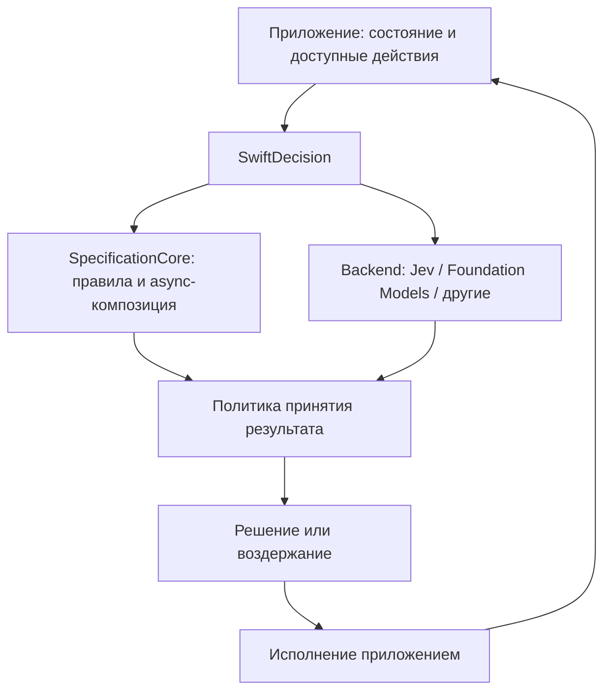

# Roadmap: SpecificationCore async API и SwiftDecision

Дата: 2026-09-20.

Статус: зафиксированное направление развития по результатам обсуждения. API ниже — проектные предложения, а не описание уже реализованных возможностей. Этапы реализации ещё не выполнены.

## Цель

Развить асинхронные механизмы SpecificationCore и использовать их как основу нового Swift-пакета [SwiftDecision](https://github.com/SoundBlaster/SwiftDecision) для типизированных модельных решений на Apple-платформах.

Применения: классификация данных, семантические проверки, выбор действий в играх и приложениях, browser automation и embedded QA tools. Поддержать backend’ы TypeSafe Jev и Apple Foundation Models, сохранив возможность подключения других моделей.

## Принятые архитектурные решения

- SpecificationCore — обязательная зависимость и основа SwiftDecision. Его спецификации непосредственно участвуют в вычислении решений.
- Общие async-контракты, композиция и выбор первого совпадения развиваются в SpecificationCore.
- SwiftDecision отвечает за модельные оценки, backend’ы, неопределённость, политику принятия результата и диагностический trace.
- Приложение предоставляет наблюдаемое состояние, доступные действия и исполняет выбранные действия.
- SpecificationCore не получает зависимостей от AI-провайдеров. Существующие синхронные API и их поведение сохраняются.
- Типизированная схема ограничивает форму ответа; корректность решения оценивается отдельно.



Типовой поток: состояние → правила применимости → модельная оценка допустимых вариантов → проверка и политика выбора → результат. Для последовательных сценариев после исполнения получается новое состояние. Независимая классификация объектов не требует цикла действий.

## 1. Async API в SpecificationCore

### Текущая основа

- `Specification`: синхронная проверка, возвращающая `Bool`, с `and`, `or`, `not`.
- `AsyncSpecification`: `isSatisfiedBy(_:) async throws -> Bool`.
- `AnyAsyncSpecification`: type erasure, async-замыкания и адаптация синхронных спецификаций.
- `DecisionSpec`: синхронный `decide(_:) -> Result?`.
- `AnyDecisionSpec`, `Specification.returning(_:)` и синхронный `FirstMatchSpec` с builder.

### Планируемые дополнения

| API | Назначение |
| --- | --- |
| `AsyncDecisionSpec` | `decide(_:) async throws -> Result?` |
| `AnyAsyncDecisionSpec` | Type erasure, async-замыкание и адаптация синхронного `DecisionSpec` |
| `AsyncFirstMatchSpec` | Последовательная проверка пар «условие — результат», первое совпадение и builder |
| `AsyncSpecification.and/or/not` | Асинхронная композиция, short-circuit для `and` и `or` |
| `AsyncSpecification.returning(_:)` | Преобразование async-проверки в типизированное решение |

Предлагаемая форма основного протокола:

```swift
public protocol AsyncDecisionSpec {
    associatedtype Context
    associatedtype Result

    func decide(_ context: Context) async throws -> Result?
}
```

### Семантика

- `nil` означает отсутствие подходящего результата; `throw` означает ошибку вычисления.
- `AsyncFirstMatchSpec` проверяет пары по порядку и прекращает вычисления после первого совпадения. Поздние условия не запускаются заранее.
- `and` не вычисляет правую часть после `false`; `or` — после `true`.
- Ошибки не преобразуются молча в `false`, `nil` или переход к следующему кандидату.
- Отмена должна завершать вычисление и не запускать оставшиеся проверки. Точки проверки cancellation требуется определить при проектировании реализации.
- Параллельная оценка, если понадобится, оформляется отдельным явно выбранным API с собственной семантикой.
- Метаданные совпадения, порядок пар и fallback должны иметь явно описанное поведение, согласованное с синхронным API.

### Проверки готовности

- [ ] Добавить async-контракты, адаптеры и композицию без изменения существующего публичного API.
- [ ] Проверить прямое создание и builder path для `AsyncFirstMatchSpec`.
- [ ] Покрыть отсутствие совпадений, несколько совпадений, порядок, fallback и метаданные.
- [ ] Проверить short-circuit, распространение ошибок и отмену; подтвердить отсутствие вызовов пропущенных условий.
- [ ] Проверить смешивание синхронных и асинхронных правил через адаптеры.
- [ ] Проверить существующие тесты, современный Swift toolchain и поддерживаемую минимальную версию, доступную в CI.
- [ ] Добавить документацию и примеры; определить версию релиза для нового API отдельно.

## 2. SwiftDecision

### Название и позиционирование

Рабочее название — **SwiftDecision**; репозиторий создан. Предлагаемое описание:

> Typed, model-assisted decisions built on SpecificationCore.

Название охватывает классификацию, оценку условий и выбор действий. Обсуждавшиеся альтернативы: SwiftDecide, DecisionKit, SwiftJudgment, SwiftPolicy. SwiftDecision остаётся основным кандидатом; полная проверка конфликтов имени ещё не проведена.

### Ответственность пакета

- Типизированное описание задачи, контекста и вариантов ответа.
- Backend’ы Jev и Foundation Models с явным описанием поддерживаемых возможностей.
- Проверка условий, классификация и оценка по шкале.
- Сохранение исходной модельной оценки до применения правил принятия результата.
- Политики выбора, воздержания, fallback и маршрутизации на дополнительную проверку.
- Использование `Specification`, `AsyncSpecification` и decision-контрактов Core для применимости, проверки результата и завершения сценария.
- Trace: входные наблюдения, выбранный вариант, результаты правил, доступные оценки, сведения о backend’е и ошибки.

Предварительные роли API: `DecisionModel` для backend’а, описание схемы задачи и `DecisionPipeline` для композиции. Имена и границы этих типов ещё не утверждены.

### Вероятности и неопределённость

- Разделять выбранное значение, вероятности вариантов, backend-specific confidence и решение прикладной политики.
- Не требовать вероятностей от backend’а, который их не предоставляет. Сгенерированное текстовой моделью поле `confidence` не приравнивать к распределению вероятностей Jev.
- Порог принятия — политика приложения, а не гарантия точности. Качество и калибровку проверять на данных конкретного сценария.
- Поддерживать воздержание от решения. `uncertain` не сводить неявно к `false` или успешной проверке.
- Текстовое объяснение не является обязательным полем общего результата: некоторые backend’ы его не возвращают.
- Ошибку backend’а хранить отдельно от содержательного отрицательного ответа и неопределённости.

Богатый результат модельной оценки можно передавать как `Result` decision-контрактов Core. Для использования в `AsyncSpecification` нужна явная политика преобразования в `Bool`, включая поведение при неопределённости. Обычная спецификация может проверять уже вычисленную оценку без повторного вызова модели.

### Опыт Jev4Mellea

Соседний проект [Jev4Mellea](https://github.com/SoundBlaster/Jev4Mellea) служит источником опыта интеграции:

- Noul — проверка условия с `p_yes` и порогами принятия/отклонения.
- Choice — выбор категории с вероятностями вариантов.
- Score — оценка по упорядоченной шкале.
- Разделение оценки и политики, явный неопределённый исход.

SwiftDecision должен учитывать эти различия. Совпадение набора возможностей разных backend’ов требует отдельной проверки; структурированная генерация сама по себе не обеспечивает эквивалентность.

## 3. Применения и демонстрационные проекты

| Пример | Модельная часть | Роль SpecificationCore | Что измерять |
| --- | --- | --- | --- |
| Inbox Triage | Категория, приоритет, необходимость ответа для сообщений или документов | Условия автоматической обработки и ручного разбора | Качество классификации, доля воздержаний, задержка, стоимость при наличии данных |
| Decision Arena | Выбор следующего хода в небольшой пошаговой игре | Допустимые ходы, ограничения и завершение | Результаты игр, число ходов, недопустимые решения, задержка |
| App Navigator | Следующее действие для достижения цели в демонстрационном приложении | Применимость действий и проверка результата | Доля завершённых сценариев, число шагов, повторные циклы |
| Embedded QA Playground | Семантические проверки и выбор шагов исследования | Инварианты, допустимые действия и условия завершения | Обнаруженные дефекты, ложные срабатывания, inconclusive, воспроизводимость |
| Browser automation | Выбор операции и элемента из наблюдаемого списка | Ограничения действий, budgets и stop conditions | Успешность сценариев и стоимость полного цикла |

Начальный набор примеров: Inbox Triage, Decision Arena и Embedded QA Playground. App Navigator и браузерный адаптер расширяют тот же подход позднее. Для browser automation исполнение и получение состояния принадлежат интеграционному слою.

Массовая классификация — целевой сценарий, но её throughput и стоимость нельзя переносить из чужих демонстраций без измерений. Требуется учесть размер контекста, ограничения провайдера, concurrency и поведение при частичных ошибках.

## 4. Embedded QA tools

Встроенные инструменты получают состояние приложения, события и перечень действий через явную интеграцию. Поддерживаются три направления:

1. **Semantic assertions:** соответствие сообщений фактическому состоянию, понятность следующего шага, смысловая согласованность интерфейса.
2. **Exploratory QA:** выбор действия, исполнение приложением, наблюдение нового состояния и проверка последствий.
3. **Диагностика:** воспроизводимый отчёт с наблюдениями, действиями, результатами правил и модельными оценками.

Пример сценария «сохранить документ»:

| Утверждение | Проверка |
| --- | --- |
| Документ появился в хранилище | Спецификация Core по фактическим данным |
| Индикатор сохранения завершился | Спецификация Core по состоянию |
| Сообщение соответствует результату операции | Модельная оценка предоставленных наблюдений |
| После ошибки понятен следующий шаг | Модельная оценка |
| Можно продолжать сценарий | Политика SwiftDecision по результатам проверок |

Результат QA-проверки: `passed`, `failed` или `inconclusive`; ошибка выполнения фиксируется отдельно. Недостаток наблюдений не считается успешной проверкой.

Одни и те же спецификации могут использоваться приложением и QA-инструментом для инвариантов и доступности действий. Проверки результата также должны независимо наблюдать фактический эффект, чтобы не повторять ошибку проверяемой логики.

Текст состояния и accessibility-данные подходят для смысловых и структурных проверок. Утверждения о визуальном расположении требуют изображений или измерений layout и подходящего evaluator’а. Наличие такой возможности не предполагается автоматически у каждого backend’а.

Для Playground подготовить сценарии с намеренно внесёнными дефектами и известными ожидаемыми результатами. Сохранять trace для разбора и повторного проигрывания наблюдений; повторный живой вызов модели не обязан давать идентичный ответ.

## 5. Последовательность реализации

### Этап 1 — Async-основа Core

Реализовать API из раздела 1, определить error/cancellation semantics, проверить совместимость и документировать. Критерий завершения: типизированные async-решения и композиция доступны без AI-зависимостей, проверки порядка и ошибок проходят.

### Этап 2 — Контракты SwiftDecision

Определить модель задачи, результат оценки, воздержание, capability-модель backend’ов и политики на спецификациях Core. Добавить управляемый fake backend. Критерий завершения: правила и модельные оценки объединяются в воспроизводимом примере без сети.

### Этап 3 — Реальные backend’ы

Реализовать Jev и Foundation Models, проверить поддерживаемые схемы, доступность моделей и платформенные ограничения. Доступ к провайдеру и платные live-проверки настраиваются явно. Критерий завершения: общий сценарий работает с обоими backend’ами, различия возможностей видны в API.

### Этап 4 — Примеры и оценка качества

Подготовить Inbox Triage, Decision Arena и Embedded QA Playground. Сравнить backend’ы на фиксированных входах, собрать результаты и ограничения. Критерий завершения: показаны полезные решения, ошибки и воздержания; измерения имеют описанную методику.

### Этап 5 — Развитие интеграций

На основе примеров уточнить API, добавить App Navigator и при необходимости browser automation, документацию интеграции и release plan. Версии, публикация и релизы определяются отдельно.

## Открытые вопросы

- Окончательные имена типов SwiftDecision и форма capabilities.
- Требования `Sendable`, изоляция состояния backend’ов и совместимость с минимальным Swift Core.
- Где хранить async metadata и как обеспечить симметрию builders без новых неоднозначных overloads.
- Точная политика ошибок, отмены, timeout, retry и budgets на каждом уровне.
- Платформенные минимумы SwiftDecision и Foundation Models backend’а; их влияние на разделение targets.
- Кэширование, batch-обработка и ограниченная concurrency для массовой классификации.
- Контракт наблюдений и действий embedded QA, связь с тестовым runner’ом и формат trace.
- Какие оценки доступны у каждого backend’а и как проверяется их качество на выбранных задачах.

## Источники обсуждения

- [TypeSafe: Introducing System One Models & Jev](https://typesafe.ai/blog/introducing-system-one-models-and-jev).
- [Apple: Generating Swift data structures with guided generation](https://developer.apple.com/documentation/foundationmodels/generating-swift-data-structures-with-guided-generation).
- [Browser Use: jev-ultrafast](https://github.com/browser-use/jev-ultrafast) — пример выбора операции и элемента из динамического списка действий.
- [Jev4Mellea](https://github.com/SoundBlaster/Jev4Mellea) — существующий адаптер и опыт разделения оценок и политик.

Ссылки задают контекст проектирования. Текущие версии API, доступность моделей, цены и платформенные требования нужно проверить на этапе реализации.

## 6. Использование новых возможностей Swift 6.4

Статус: список направлений для оценки и последующей реализации. Сам факт появления возможности в toolchain не является причиной менять API или минимальную версию Swift. Проверять каждое направление отдельно и сохранять поддержку заявленных проектом toolchain.

### Приоритет 1 — SBOM для релизов SwiftPM

SwiftPM 6.4 умеет собирать SBOM в форматах CycloneDX и SPDX. Это полезно для SwiftDecision из-за необязательного MLX backend и его транзитивных зависимостей.

- [ ] Сделать пилот генерации CycloneDX SBOM для SwiftDecision с помощью SwiftPM/Swift Build.
- [ ] Сравнить граф зависимостей в стандартной конфигурации и при включённом trait `MLX`; выяснить, как traits и условные зависимости отражаются в файле.
- [ ] Проверить, что SBOM относится к успешно собранному продукту и зафиксированному `Package.resolved`, затем сохранять его как CI artifact.
- [ ] После проверки прикладывать SBOM к релизу SwiftDecision; отдельно решить, нужен ли SPDX.

Команда для пробного запуска на Swift 6.4:

```sh
swift build --build-system swiftbuild --sbom-spec cyclonedx --sbom-output-dir ./artifacts/sbom
```

### Приоритет 2 — проверить WebAssembly сценарий

Изучить запуск общего механизма правил и модельно-независимой логики в Wasm. Целевой первый эксперимент — SpecificationCore плюс SwiftDecision с детерминированным fake backend; Foundation Models и MLX остаются отдельными нативными backend’ами.

- [ ] Выбрать один конкретный сценарий: например, запуск правил и решения в браузерном QA playground.
- [ ] Проверить доступность Swift SDK для Wasm и собрать минимальный executable без MLX, Jev и Apple-only API.
- [ ] Проверить реальные ограничения SwiftPM targets, macros, Foundation и JavaScript bridge; не считать поддержку Wasm доказанной до работающего прототипа.
- [ ] Описать границу host bridge: входное состояние и доступные действия передаются явно, результат возвращается приложению для исполнения.
- [ ] Решить, приносит ли прототип самостоятельную пользу; только после этого планировать официальный support matrix.

### Приоритет 3 — асинхронная очистка и отмена

Async `defer` и cancellation shields могут помочь backend’ам с ресурсами и асинхронным завершением сессий.

- [ ] При добавлении session-based backend определить операции `finish`/cleanup, которые обязаны завершиться после отмены.
- [ ] Рассмотреть async `defer` вместе с узким `withTaskCancellationShield` вокруг только такой очистки.
- [ ] Проверить cancellation и timeout тестами, чтобы cleanup не скрывал отмену основного запроса и не блокировал возврат из timeout.
- [ ] Не применять shield ко всему inference-вызову без конкретной гарантии жизненного цикла.

### Приоритет 4 — инструменты разработки и parity harness

Swift Subprocess предоставляет concurrency-aware API для запуска внешних программ. Возможное применение — отдельный development tool для запуска parity/reference сценариев или подготовки benchmark данных.

- [ ] Сначала определить конкретный parity или benchmark workflow, которому нужно управлять внешним процессом.
- [ ] Если такой сценарий появится, проверить Swift Subprocess в отдельной утилите или test-support target.
- [ ] Не добавлять Subprocess в runtime зависимости SwiftDecision или SpecificationCore без пользовательского сценария, который этого требует.

### Приоритет 5 — performance-эксперименты с коллекциями

`Iterable` предназначен прежде всего для borrowing iteration, noncopyable и неэкранируемых значений. `UniqueArray` ориентирован на хранение noncopyable элементов без copy-on-write затрат; это не универсальная замена `Array`.

- [ ] Сначала получить профилировку или benchmark, показывающий копирование/аллоцирование как значимую стоимость.
- [ ] Отдельно проверить кандидатов в SpecificationCore: большие наборы пар `FirstMatchSpec`, преобразования коллекций и tracing event storage.
- [ ] Пробовать новые типы только для измеренного hot path и сохранить сравнение производительности и читаемости.

### Приоритет 6 — постепенное ужесточение compiler diagnostics

`@diagnose` позволяет локально повышать или ослаблять отдельные группы предупреждений. Это может пригодиться при будущей миграции устаревшего кода или поэтапном включении строгих диагностик.

- [ ] Перед применением определить конкретную warning group и политику, которую нельзя выразить подходящими настройками CI.
- [ ] Использовать локальные исключения с обоснованием; не подавлять предупреждения широкими областями.

### Исследовать при конкретном интеграционном запросе

- C++/Java interop не относится к текущей архитектуре SwiftDecision и SpecificationCore. Возвращаться к нему, если появится конкретный host или native API, недоступный через имеющиеся Swift backend’ы.
- Swift Testing в Swift 6.4 допускает постепенное смешивание с XCTest. Мигрировать тесты только ради единообразия не требуется; использовать возможности повтора и диагностик там, где они помогают отлаживать flaky concurrency или интеграционные проверки.
- Swift Build уже применяется в CI через обычные `swift build` на актуальном Swift 6.4 toolchain, где он используется SwiftPM по умолчанию. Сохранять такой CI lane и минимальные toolchain lanes; отдельная миграция сборочных команд пока не нужна.

### Границы совместимости

- Не поднимать `swift-tools-version` только ради интереса к новой языковой возможности; оценивать минимальную версию отдельно для каждого пакета.
- Не добавлять процессные, Wasm, C++ или Java зависимости в ядро SpecificationCore.
- Сохранять MLX и другие платформенные backend’ы необязательными и изолированными от общего контракта решений.
- Для performance и platform claims хранить воспроизводимые результаты измерений и успешную сборку целевой конфигурации.

Источники: [Swift 6.4 release](https://www.swift.org/blog/swift-6.4-released/), [SE-0509 SBOM in SwiftPM](https://github.com/swiftlang/swift-evolution/blob/main/proposals/0509-swift-sboms-via-swiftpm.md), [SE-0504 cancellation shields](https://github.com/swiftlang/swift-evolution/blob/main/proposals/0504-task-cancellation-shields.md), [SE-0516 Iterable](https://github.com/swiftlang/swift-evolution/blob/main/proposals/0516-borrowing-sequence.md), [Swift Subprocess](https://github.com/swiftlang/swift-subprocess).
